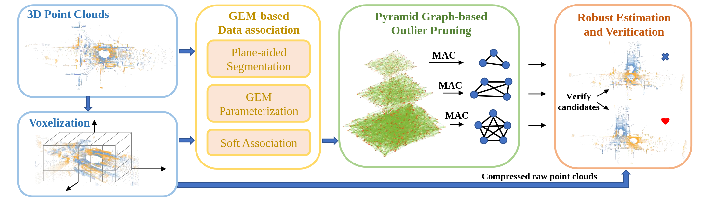

# <div align = "center"> G3Reg: </div>

## <div align = "center">Pyramid Graph-based Global Registration using Gaussian Ellipsoid Model</div>

<div align="center">
<a href="https://arxiv.org/abs/2308.11573"></a>
<a href="https://youtu.be/4OeZ9bVsxcY?si=180BzZ-lxak1iq69">

</a>
<a ></a>
<a href="https://github.com/HKUST-Aerial-Robotics/G3Reg/stargazers">

</a>
<a href="https://github.com/HKUST-Aerial-Robotics/G3Reg/network/members">

</a>
<a href="https://github.com/HKUST-Aerial-Robotics/G3Reg/issues">

</a>
</div>

> [Zhijian Qiao](https://qiaozhijian.github.io/), Zehuan Yu, Binqian Jiang, [Huan Yin](https://huanyin94.github.io/), and [Shaojie Shen](https://uav.hkust.edu.hk/group/)
>
> IEEE Transactions on Automation Science and Engineering

### News
* **`03 Apr 2024`:** Accepted by [IEEE TASE](https://ieeexplore.ieee.org/xpl/RecentIssue.jsp?punumber=8856)! 
* **`19 Dec 2023`:** Conditionally Accept.
* **`22 Aug 2023`:** We released our paper on Arxiv and submit it to [IEEE TASE](https://ieeexplore.ieee.org/xpl/RecentIssue.jsp?punumber=8856).


## Abstract
<div align="center"><h4>G3Reg is a fast and robust global registration framework for point clouds.</h4></div>

<div align = "center"> </div>

**Features**:
+ **Fast matching**: We utilize segments, including planes, clusters, and lines, parameterized as Gaussian Ellipsoid Models (GEM) to facilitate registration.
+ **Robustness**: We introduce a distrust-and-verify scheme, termed Pyramid Compatibility Graph for Global Registration (PAGOR), designed to enhance the robustness of the registration process.
+ **Framework Integration**: Both GEM and PAGOR can be integrated into existing registration frameworks to boost their performance. 

**Note to Practitioners**:
+ **Application Scope**: The method outlined in this paper focuses on global registration of outdoor LiDAR point clouds. However, the fundamental principles of G3Reg, including segment-based matching and PAGOR, are applicable to any point-based registration tasks, including indoor environments.
+ **Segmentation Check**: If the registration does not perform as expected on your point cloud, it is advisable to review the segmentation results closely.
+ **Alternative Matching Approaches**: For practitioners preferring not to use GEM-based matching, point-based matching is a viable alternative. For implementation details, please refer to the configuration file at [fpfh_pagor](configs/kitti_lc_bm/fpfh_pagor.yaml).
+ **Limitations**: Segment-based matching may be less effective in environments with sparse geometric information, such as areas with dense vegetation. In such scenarios, enhancing segment descriptions through hand-crafted or deep learning-based descriptors is recommended to improve matching accuracy.

## Getting Started
- [Installation](docs/install.md)
- [Demo](docs/demo.md)
- [Benchmarks](docs/benchmarks.md)

## Qualitative results on datasets
### KITTI-08
https://github.com/HKUST-Aerial-Robotics/G3Reg/assets/21232185/8f4091b5-5305-4236-afb6-00ea5799ecd7
### Apollo-Highway
https://github.com/HKUST-Aerial-Robotics/G3Reg/assets/21232185/f1d4c9ad-04e9-4cf4-890a-12714f74eb59
### Apollo-Sunnyvale
https://github.com/HKUST-Aerial-Robotics/G3Reg/assets/21232185/60c7bf50-cd1c-447d-964d-1902e4db0489
### Livox-HIT-1
https://github.com/HKUST-Aerial-Robotics/G3Reg/assets/21232185/ee1d9dd1-d460-4970-b060-ada25bc8e004
### Livox-HIT-3
https://github.com/HKUST-Aerial-Robotics/G3Reg/assets/21232185/ef453f89-c92b-4d26-b232-3db2e3bac3f3
## Application to Multi-session Map Merging
<div align="center">
    
</div>

## Acknowledgements
We would like to show our greatest respect to authors of the following repos for making their works public:
* [Teaser](https://github.com/MIT-SPARK/TEASER-plusplus)
* [Segregator](https://github.com/Pamphlett/Segregator)
* [Quatro](https://github.com/url-kaist/Quatro)
* [3D-Registration-with-Maximal-Cliques](https://github.com/zhangxy0517/3D-Registration-with-Maximal-Cliques)

## Citation
If you find G3Reg is useful in your research or applications, please consider giving us a star 🌟 and citing it by the following BibTeX entry.
```bibtex
@article{qiao2023g3reg,
  title={G3Reg: Pyramid Graph-based Global Registration using Gaussian Ellipsoid Model},
  author={Qiao, Zhijian and Yu, Zehuan and Jiang, Binqian and Yin, Huan and Shen, Shaojie},
  journal={arXiv preprint arXiv:2308.11573},
  year={2023}
}
```
```bibtex
@inproceedings{qiao2023pyramid,
  title={Pyramid Semantic Graph-based Global Point Cloud Registration with Low Overlap},
  author={Qiao, Zhijian and Yu, Zehuan and Yin, Huan and Shen, Shaojie},
  booktitle={2023 IEEE/RSJ International Conference on Intelligent Robots and Systems (IROS)},
  pages={11202--11209},
  year={2023},
  organization={IEEE}
}
```
