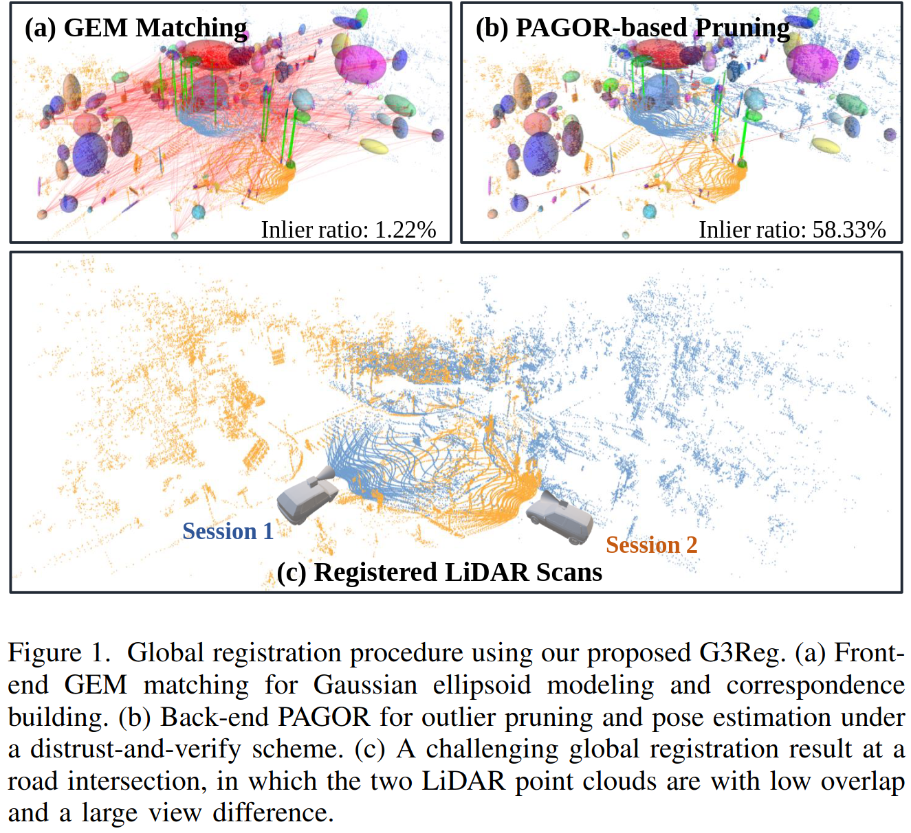
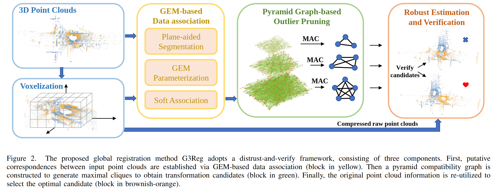
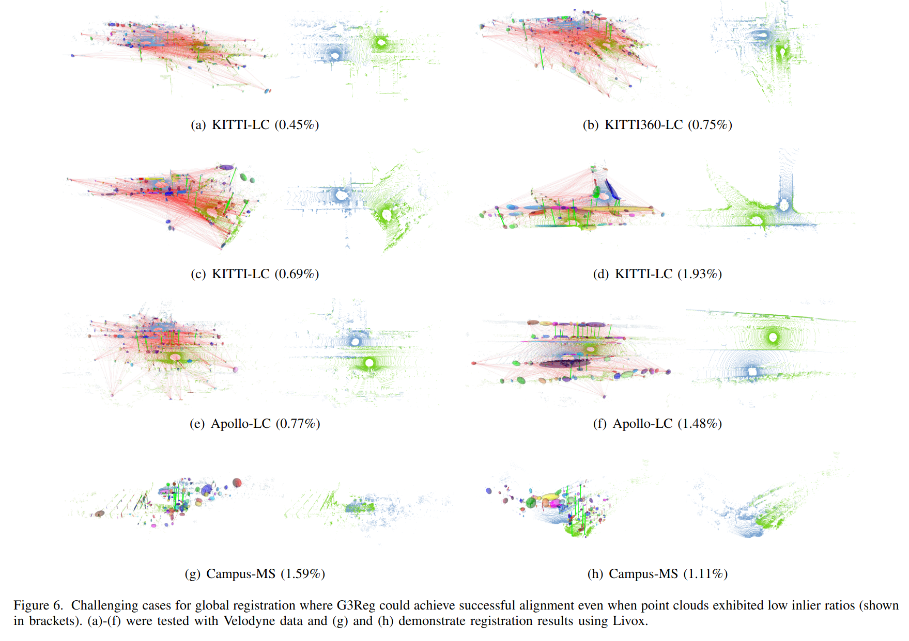
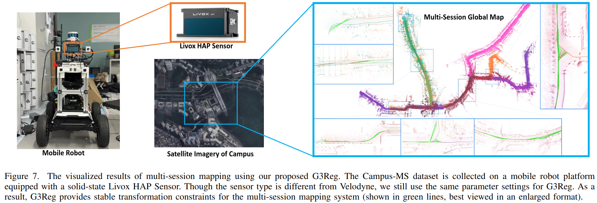

## Introduction

This is the official code repository of "G3Reg: Pyramid Graph-based Global Registration using Gaussian Ellipsoid Model" ([arxiv](https://arxiv.org/abs/2308.11573)). 

This work is an extended version of our IROS2023 paper [Pagor](https://arxiv.org/abs/2307.12116)([code](https://github.com/HKUST-Aerial-Robotics/Pagor)). In comparison, the journal version presents several notable enhancements, including a more efficient front-end approach that eliminates the need for the semantic segmentation network. Additionally, we have significantly improved our distrust-and-verify framework in terms of both efficiency and robustness.

Welcome to give reviews and feedbacks to our work in the [issues](https://github.com/HKUST-Aerial-Robotics/G3Reg/issues) page.

## Overview
### Global Registration with Low Overlap

    

### System Pipeline

    

### Visualization

    

### Application to Multi-session Map Merging

    

